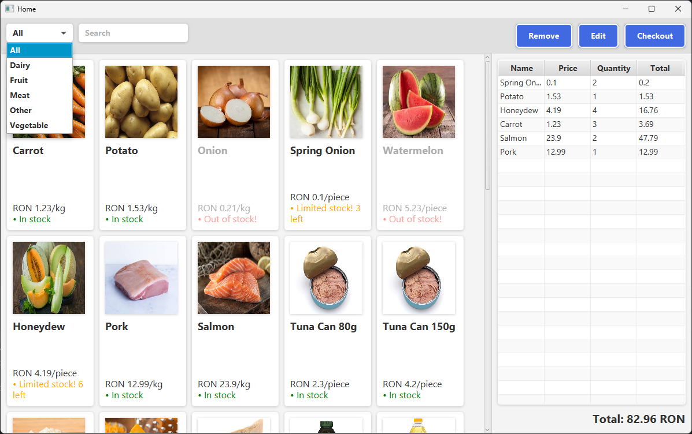
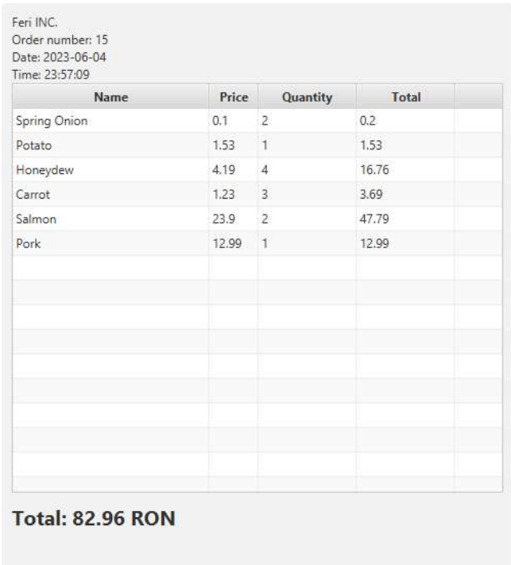

# Customer Billing App

## Description

This is a simple app I made as a project for my Java class. It connects to a
database hosted on Microsoft Azure and fetches the data prom a ```product``` table.
The app allows you to log in using your credentials from the database and select
products from a list.
After checking out, the app will generate a pdf file with the bill and update
quantity of the products in the database.

You can filter the products by category or search for a specific product by name.

## Installation

Unfortunately, Microsoft Azure does not allow me to share the database connection
information, so you will have to create your own database and change the connection
information in the ```userLogin()``` method in ```src/gui/Login.java``` file to 
connect to your database. You will also have to create a table called ```product```
and populate it with some data. The table should have the following columns:

* ```ProductID``` - int, primary key, auto increment, not null
* ```Name``` - varchar(50), not null
* ```Price``` - float, default 0
* ```Quantity``` - float, default 0
* ```Category``` - ```enum('Vegetable', 'Fruit', 'Meat', 'Dairy', 'Other')```, default 'Other'
* ```Unittype``` - ```enum('kg', 'pcs')```, default 'pcs'

## Usage

The app is pretty simple to use. You can log in using your credentials
from your database. You can then select some products from a list and
add them to your cart. You can also remove products from your cart or
change the quantity of the products in your cart. When you are done
selecting products, you can click the ```Checkout``` button to see.

## Interface

The main screen of the app:
You can see the products in the list on the left. You can select a product
and add it to your cart by clicking the ```Add``` button. You can also
remove products from your cart by clicking the ```Remove``` button. You can
change the quantity of the products in your cart by clicking the ```Edit```
button. You can also see the total price of the products in your cart in the
bottom right corner.



The bill pdf file:
The bill is generated using the ```JavaFX``` library, which is also used
for the entire app. The bill is generated using the ```gui/Actions.java``` file,
which contains the ```printBill()``` method.


